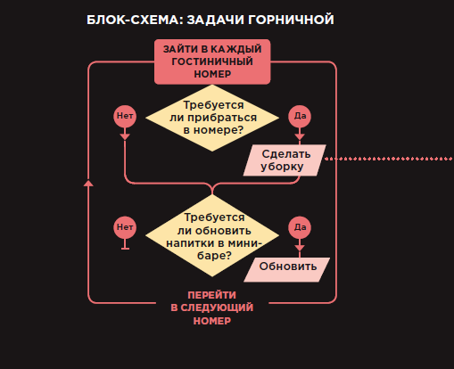
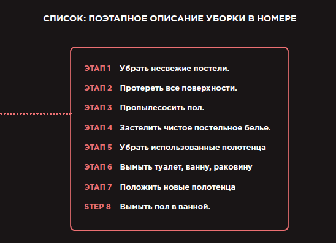
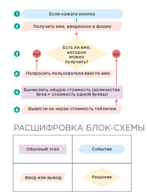
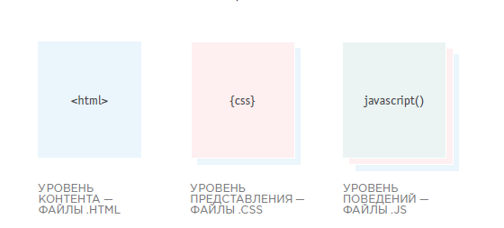

**Программирование** - создание программ для устройств, после выполнения которых устройства возвращают требуемый результат.

**Программа, сценарий (скрипт)** - последовательный набор (алгоритм) команд, инструкций для устройства.

**Язык программирования** - язык общения программиста и  устройства. Устройство понимает машинный код (в двоичной системе счисления): сигнал - нет сигнала. Программы получают данные из языка людей и последовательно преобразуют их в серии программ в машинный код. Устройство вычисляет и возвращает результат, который проходит обратную переработку.

**Низкоуровневые языки** - языки более близкие к машинному коду (железу), например драйвера. Высокоуровневые языки наиболее приближены к данным на языке людей.

Исполнение машинного кода возложено на процессор устройства. Хранение программ - на жесткий диск (энергонезависимый и медленнодействующий). Для обработки данных нужные файлы программ и данных переносятся в оперативную память (энергозависимую и более быструю).

Все данные человеческого языка размечаются специальными символами и упаковываются в специальные контейнеры-выражения со значениями (файлы с разметкой и расширением, переменные, функции, объекты, все что возвращает значение (т.е. - любое выражение)).

ЮКаждый язык программирования имеет свою парадигму выражений, операторов и операций и свой синтаксис (разметку).

#### Создание сценария
Перед написанием сценария необходимо обозначить желаемую `цель`, а затем составить список `задач`, которые должны быть решены для ее достижения.

Компьютер не способен обучаться, подобно людям. Он не накапливает опыта, поэтому всякий раз при решении задачи должен выполнять все инструкции от начала и до конца. Программа должна давать компьютеру достаточно подробное описание решения, поскольку он всегда выполняет задачу так, словно столкнулся с ней впервые.

Необходимо научиться думать как компьютер, ведь он решает задачи совсем не так, как человек . Компьютер делает это программно. Он выполняет ряд инструкций , одну за другой Компьютеры создают модели реальности на основании имеющихся данных.

+ В этих моделях используются объекты, представляющие различные явления реального мира. Объекты могут иметь: свойства, сообщающие информацию о качествах объекта; методы, выполняющие задачи с применением свойств конкретного объекта; события, происходящие в процессе взаимодействия человека с компьютером.
+ Программист может написать код, означающий: «Когда произойдет такое-то событие, выполни такой-то код».
+ Браузеры используют HTML-разметку для создания модели веб-страницы. Каждый элемент веб-страницы создает собственный узел (также являющийся объектом).
+ Чтобы добиться интерактивности вебстраниц, программист пишет код, оперирующий браузерной моделью веб-страницы. Три вышеуказанных уровня — это три кита, на которых зиждется популярный подход к созданию веб-страниц. Такой подход называется прогрессивным улучшением.

Три вышеуказанных уровня — это три кита, на которых зиждется популярный подход к созданию веб-страниц. Такой подход называется прогрессивным улучшением.

