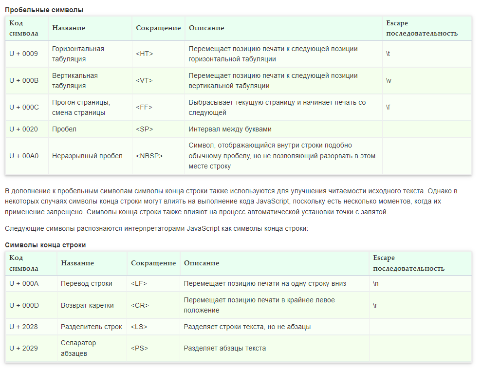

#### Набор символов
При написании программ на JavaScript используется набор символов Unicode. В отличие от 7-разрядной кодировки ASCII, подходящей только для английского языка, и 8-разрядной кодировки ISO Latin-1, подходящей только для английского и основных западноевропейских языков, 16-разрядная кодировка Unicode поддерживает практически все письменные языки, имеющиеся на планете. Стандарт ECMAScript v3 требует, чтобы реализации JavaScript обеспечивали поддержку стандарта Unicode версии 2.1 или выше, а стандарт ECMAScript v5 требует, чтобы реализации обеспечивали поддержку стандарта Unicode версии 3 или выше.

#### Пробельные символы
Интерпретатор JavaScript игнорирует все пробельные символы которые могут присутствовать между языковыми конструкциями и воспринимает текст программы как сплошной поток кода.
Кроме того, JavaScript также, по большей части, игнорирует символы перевода строки. Поэтому пробелы и символы перевода строки могут без ограничений использоваться в исходных текстах программ для форматирования и придания им удобочитаемого внешнего вида.

#### Точка с запятой
Программа (сценарий) на языке JavaScript представляет собой перечень «инструкций», которые выполняются веб-браузером.
В JavaScript инструкции, как правило, разделяются точкой с запятой (;).

Если несколько инструкций располагаются на одной строке, то между ними следует поставить знак "точка с запятой" (;).

#### Чувствительность к регистру
Для написания JavaScript-пpoгpaмм используется набор символов Unicode, который включает в себя наборы ASCII и Latin-1 и поддерживается практически всеми языками и платформами.
В JavaScript все элементы, включая имена переменных, функций и операторов, чувствительны к регистру и должны всегда содержать одинаковые наборы прописных и строчных букв. Например, ключевое слово while должно набираться как «while», а не «While» или «WHILE».

Аналогично num, NUM и Num – это три разные переменные:

#### Комментарии
Комментарии позволяют выделить фрагмент программы, который не выполняется интерпретатором JavaScript, а служит лишь для пояснений содержания программы.
Комментарии в JS могут быть однострочными и многострочными.
#### Идентификаторы

Идентификатор - это последовательность букв, цифр, символов подчёркивания (_) и знаков доллара ($). Цифра не может быть первым символом идентификатора, т. к. тогда интерпретатору JavaScript труднее отличать идентификаторы от чисел. Идентификаторы выступают в качестве имён переменных, функций, свойств объекта и т. д.
Для совместимости и простоты редактирования для составления идентификаторов обычно используются только символы ASCII и цифры. Однако в ECMAScript v3 идентификаторы могут содержать буквы и цифры из полного набора символов Unicode. Это позволяет программистам давать переменным имена на своих родных языках и использовать в них математические символы:Исторически, программисты использовали разные способы объединения нескольких слов для записи идентификаторов. Сегодня есть два устоявшихся негласных стиля: camelCase и snake_case.
В JavaScript наиболее популярным стилем именования идентификаторов, состоящих из нескольких слов, является camelCase – "верблюжья" нотация. Это означает, что первая буква является строчной, а первые буквы всех последующих слов – прописными, например:

#### Ключевые и зарезервированные слова
 В JavaScript ключевые слова, зарезервированные слова и значения true, false и null не могут быть идентификаторами.

**Итоги**
+ Интерпретатор JavaScript игнорирует все пробельные символы которые могут присутствовать между языковыми конструкциями и воспринимает текст программы как сплошной поток кода.
+ Кроме того, JavaScript также, по большей части, игнорирует символы перевода строки. Поэтому пробелы и символы перевода строки могут без ограничений использоваться в исходных текстах программ для форматирования и придания им удобочитаемого внешнего вида.
+ Пропуск точек с запятой нельзя признать правильной практикой программирования, и поэтому желательно выработать привычку их использовать.
+ В JavaScript все элементы, включая имена переменных, функций и операторов, чувствительны к регистру и должны всегда содержать одинаковые наборы прописных и строчных букв.
+ Не пренебрегайте комментариями в своих кодах. Они пригодятся вам при отладке и сопровождении программ. Не переживайте насчет увеличения размера кода, т.к. существуют инструменты сжатия JavaScript, которые, при публикации, легко удалят комментарии.
+ Идентификаторы выступают в качестве имён переменных, функций, свойств объекта и состоят из последовательности букв, цифр, символов подчёркивания (_) и знаков доллара ($).
+ Ключевые слова JavaScript, применяемые для обозначения элементов синтаксиса языка, а также другие слова, зарезервированные на будущее, нельзя использовать в качестве имен переменных, функций и объектов.
