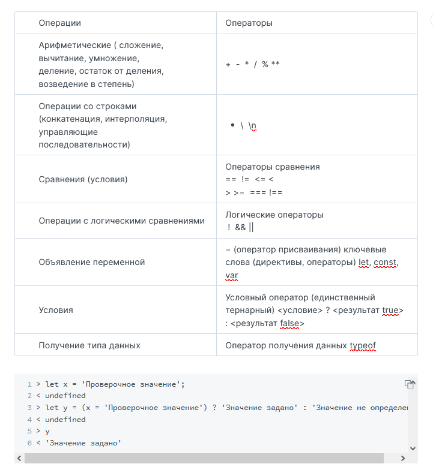

Интерпретатор - программа выполняющая код на JavaScript.
Инструкция (statement) - команда для компьютера, написанная на языке программирования. Код на JavaScript — это набор инструкций, разделенных (чаще всего) символом ;.

