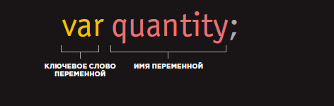
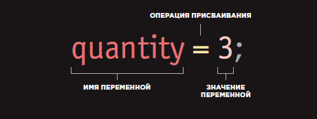

Переменная – это «именованное хранилище» для данных, контейнер-выражение возвращающее значение

Директивы let, var, const

Директива let позволяет объявить локальную переменную с областью видимости, ограниченной текущим блоком кода . В отличие от ключевого слова var, которое объявляет переменную глобально или локально во всей функции, независимо от области блока.

Переменные, объявленные с помощью const, называются «константами». Их нельзя изменить.
Широко распространена практика использования констант в качестве псевдонимов для трудно запоминаемых значений, которые известны до начала исполнения скрипта. Другими словами, константы с именами, записанными заглавными буквами, используются только как псевдонимы для «жёстко закодированных» значений.

Если имя содержит несколько слов, обычно используется верблюжья нотация.

В JavaScript есть два ограничения, касающиеся имён переменных:
Имя переменной должно содержать только буквы, цифры или символы $ и _.
Первый символ не должен быть цифрой.

Переменные с именами apple и AppLE – это две разные переменные.

Существует список зарезервированных слов, которые нельзя использовать в качестве имён переменных, потому что они используются самим языком.

Сценарию часто бывает нужно какое-то время сохранять фрагменты информации, необходимые для выполнения задачи. Эти данные можно хранить в переменных .

Переменная — очень точное наименование для данной концепции, поскольку данные, хранимые в переменной, могут меняться (варьироваться) при каждом прогоне сценария. переменные часто используются в сценариях для работы с такими данными, которые часто меняются.

Результат вычисляется или высчитывается на основании значений, сохраненных в переменных. Использование переменных для представления чисел или других видов данных очень напоминает алгебраическое понимание переменных (где числа обозначаются буквами).

 Однако между программированием и алгеброй существует важнейшее различие, которое заключается в функционировании знака равенства (об этой разнице мы поговорим на следующих двух страницах).

Итоги
В JavaScript можно объявлять переменные используя ключевые слова var, let и const.
При объявлении переменной желательно указать ее первоначальное значение, поскольку если забыть ее инициализировать перед первым исполь­зованием, результаты вычисления могут быть неопределенными.
JavaScript – это нетипизированный язык, в частности, это значит, что переменная может содержать значение любого типа.
Глобальные переменные принято объявлять в начале скрипта, чтобы все функции наследовали эти переменные и их значения.
Внутри программной единицы (функции, подпрограммы, блока) локальная переменная имеет преимущество перед глобальной переменной с тем же именем.
