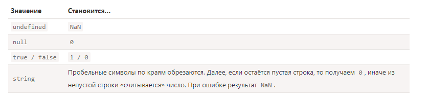
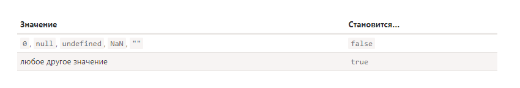

JavaScript – язык с динамической типизацией данных. Это значит, что в одну и ту же переменную можно записывать значения различных типов, при этом тип самой переменной будет меняться.
Автоматическое преобразование типов является одной из самых мощных возможностей JavaScript, но и самой потенциально опасной для начинающего программиста.

#### Явное и неявное преобразование
Преобразование типов данных может быть явным и неявным. Так как JavaScript – это слабо типизированный или динамический язык программирования, значения могут быть конвертированы между различными типами автоматически. Это называют неявным приведением типов. Обычно неявное преобразование происходит, когда в выражениях используют значения различных типов.

Явное преобразование – это когда преобразование типов данных выполняет сам программист. Явное преобразование иначе называют приведением типов:
```javascript
alert( '8' / '2' );                   // 4 (Неявное преобразование)
alert( Number('8') / Number('2') );   // 4 (Явное преобразование)

```
Для явного преобразования в примитивные типы данных в JavaScript используются следующие функции: Boolean(), Number(), String(). При неявном преобразования интерпретатор JavaScript автоматически использует те же самые функции, что используются и для явного преобразования.

Вместо функций для явного преобразования типов данных можно использовать операторы. Например, если один из операндов оператора сложения + является строкой, то другой операнд также преобразуется в строку. Операции инкремента -- или декремента ++ над строкой приведут её к числу. Унарный оператор плюс + преобразует свой операнд в число, а унарный оператор отрицания ! преобразует операнд в логическое значение и инвертирует его:
```javascript
alert( true + "test" ); // "truetest"   (То же, что и String(true))
alert( +"123" );        // 123   (То же, что и Number("123"))
alert( !!"0" );         // true  (То же, что и Boolean("0"))
```

#### Три типа
Существует 3 наиболее широко используемых преобразования: ***строковое, численное и логическое.***

#### Преобразование к типу String. String()
```javascript
document.writeln((String(null) === "null") + "<br>"); // true
document.writeln(String(123) + "<br>");               // '123'
document.writeln(String(-77.7) + "<br>");             // '-77.7'
document.writeln(String(null) + "<br>");              // 'null'
document.writeln(String(undefined) + "<br>");         // 'undefined'
document.writeln(String(true) + "<br>");              // 'true'
document.writeln(String(false) + "<br>");             // 'false'
document.writeln(123 + '');                           // '123'
```
При преобразовании строк в числа интерпретатор обрезает пробелы, а также управляющие символы (перенос строки \n, табуляция \t, вертикальная табуляция \v и др.), которые находятся в начале или в конце строки.
Если строка содержит только цифры с унарным оператором - или + либо без знака, она всегда преобразуется в целое десятичное число (отрицательное или положительное). Начальные нули игнорируются, например "007" преобразуется в 7.
Если строка представляет собой число в шестнадцатеричном формате, она преобразуется в соответствующее целое десятичное число.
Пустая строка преобразуется в 0.
Если строка содержит что-то отличное от предыдущих вариантов, например инкремент (декремент), она преобразуется в NaN.

#### Преобразование к типу Number Number()
```javascript
document.writeln(Number(null))                 // 0
document.writeln("<br>" + Number(undefined))   // NaN
document.writeln("<br>" + Number(true))        // 1
document.writeln("<br>" + Number(false))       // 0
document.writeln("<br>" + Number(" 77 \t"))    // 77
document.writeln("<br>" + Number("-77.7"))     // -77.7
document.writeln("<br>" + Number("\n"))        // 0
document.writeln("<br>" + Number(" 12x "))     // NaN
document.writeln("<br>" + Number(123))         // 123
```
Числа возвращаются без каких либо изменений.
true преобразуется в 1.
b>false преобразуется в 0.
Значение null преобразуется в 0.
Значение undefined преобразуется в NaN.
Преобразование к типу Number выполняют следующие операторы:

Операторы сравнения <, >, <=, >=.
Арифметические операторы +, -, *, /, %.
Унарный оператор +.
Побитовые операторы ^, |, &, ~.
Операторы нестрогого равенства == и неравенства !=.

#### Преобразование к типу Boolean Boolean()
```javascript
document.writeln(Boolean(''))                    // false
document.writeln('<br>' + Boolean(0))            // false
document.writeln('<br>' + Boolean(-0))           // false
document.writeln('<br>' + Boolean(NaN))          // false
document.writeln('<br>' + Boolean(null))         // false
document.writeln('<br>' + Boolean(undefined))    // false
document.writeln('<br>' + Boolean(false))        // false
```
Следующие значения в результате преобразования дают логическое false: undefined, null, 0, -0, NaN, "".
Значение false возвращается без изменений.
Все остальные значения в результате преобразования дают логическое true (включая объекты, функции, массивы, даты, значения типа Symbol, пустые объекты и пустые массивы).
Неявное преобразование происходит в логическом контексте либо вызывается логическими операторами ||, &&, !:





Итоги
Первая особенность работы с типами в JavaScript, заключается в том, что существует три вида преобразований:
В строку: String(значение) – в строковом контексте или при сложении со строкой.
В число: Number(значение) – в численном контексте, включая унарный плюс +значение.
В логическое значение: Boolean(значение) – в логическом контексте, можно также преобразовать двойным отрицанием: !!значение.
Любое значение, не входящее в этот список: false, undefined, null, 0, -0, NaN, "", преобразуется в true.
Оператор == не производит неявного преобразования в число, если оба операнда являются строками.
Оператор + с двумя операндами не вызывает неявное преобразование к числовому типу, если хотя бы один оператор является строкой.
При применении оператора == к null или undefined преобразования в число не производится. Значение null равно только null или undefined и не равно ничему больше.
При преобразовании в числа значений null и undefined: null преобразуется в число 0, в то время как undefined – в NaN (не число).
