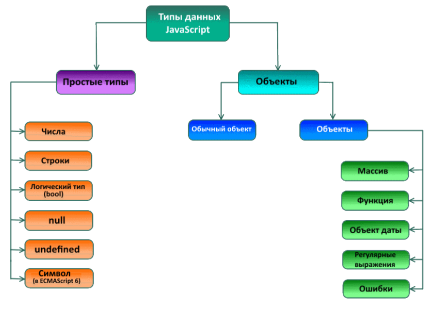

#### Оператор typeof
Для языка со слабой типизацией необходим интструмент **определения типа данных в переменных.** . То есть он не не определяет данные сами по себе, а выявляет тип по синтаксису данных в переменных. Оператор typeof позволяет нам увидеть, какой тип данных сохранён в переменной.

Имеет две формы: typeof x или typeof(x).
Возвращает строку с именем типа. Например, "string".
Для null возвращается "object" – это ошибка в языке, на самом деле это не объект.

#### Типы данных

В JavaScript есть 8 основных типов.

number для любых чисел: целочисленных или чисел с плавающей точкой; целочисленные значения ограничены диапазоном ±(253-1).
bigint для целых чисел произвольной длины.
string для строк. Строка может содержать ноль или больше символов, нет отдельного символьного типа.
boolean для true/false.
null для неизвестных значений – отдельный тип, имеющий одно значение null.
undefined для неприсвоенных значений – отдельный тип, имеющий одно значение undefined.
object для более сложных структур данных.
symbol для уникальных идентификаторов.
Оператор typeof позволяет нам увидеть, какой тип данных сохранён в переменной.

Имеет две формы: typeof x или typeof(x).
Возвращает строку с именем типа. Например, "string".
Для null возвращается "object" – это ошибка в языке, на самом деле это не объект.
В следующих главах мы сконцентрируемся на примитивных значениях, а когда познакомимся с ними, перейдём к объектам.

####  Динамическая типизация в переменных
В процессе работы компьютерные программы манипулируют различными значениями, каждое из которых может быть обработано в языке программирования и относится к определённому типу данных.
В JavaScript типы данных можно разделить на две категории: простые (их также называют примитивными) типы и составные (их также называют ссылочными или объекты).

JavaScript – это слабо типизированный или динамический язык программирования, который позволяет определять типы данных, осуществлять синтаксический анализ и компиляцию как говорится «на лету», на этапе выполнения программы. Это значит, что вам не нужно определять тип переменной заранее. Тип определится автоматически во время выполнения программы.

#### Итоги
Оператор typeof x позволяет выяснить, какой тип находится в x, возвращая его в виде строки.
Когда мы присваиваем переменную простого типа в другую, она копирует значение. В результате каждая переменная будет иметь своё значение и изменения в одной из переменных никак не сказывается на значении другой переменной.
Когда мы присваиваем одну переменную (в значении которой ссылка на составное значение) другой переменной, то происходит копирование ссылки на составное значение. В результате обе переменные ссылаются на одно и то же составное значение и изменения в значении одной из переменных будут сказываться на другой переменной.
Любое выражение, которое возвращает значение 0, null, undefined или пустую строку, интерпретируется как false.
Строки создаются при помощи двойных (") или одинарных (') кавычек. В строке, ограниченной парой одинарных кавычек, можно использовать двойные кавычки, и наоборот – одинарные кавычки можно использовать в строке, заключенной в пару двойных кавычек.
Значение null является ссылкой на «пустой» объект и имеет специальное назначение – обычно оно используется для инициализации переменной, которой впоследствии будет присвоено значение.
Значение (undefined) имеет переменная, объявленная с помощью оператора var, но не инициализированная.
В JavaScript объекты можно создавать одним из двух способов:
с помощью объектного литерала
с помощью метода, называемого конструктором
Объект содержит неупорядочен­ную коллекцию свойств, каждое из которых содержит имя и значение. В объект можно в любой момент добавить новые именованные значения или удалить существующие.

