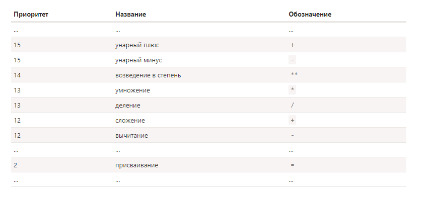

## Операторы

> Операция, оператор, операнды. Операторы предназначены для составления выражений. Оператор применяется к одному или двум данным, которые называются операндами или аргументами оператора.

+ Опepaтopы в JavaScript уникальны в том смысле, что их можно задействовать с самыми различными значениями, включая строки, числа, логические значения и даже объекты.
+ Операторы предназначены для составления выражений. Оператор применяется к одному или двум данным, которые называются операндами.
+ Приоритет операторов определяет очередность их выполнения в выражении. Все операторы делятся на группы с различными уровнями приоритета от 0 до 20.

**Список категория операторов:**
+ Унарные операторы
+ Поразрядные операторы
+ Логические операторы
+ Мультипликаивные  операторы (умножение, деление, деление по модулю)
+ Операторы сложения и вычитания
+ Операторы отношений > >= < <=
+ Операторы эквивалентности == === != !==
+ Условный оператор
+ Операторы присваивания
+ Оператор `запятая`

#### Базовые операторы, математика
Операнд – то, к чему применяется оператор. Например, в умножении 5 * 2 есть два операнда: левый операнд равен 5, а правый операнд равен 2. Иногда их называют «аргументами» вместо «операндов».

Унарным называется оператор, который применяется к одному операнду. Например, оператор унарный минус "-" меняет знак числа на противоположный. К унарным относятся инкремент и декремент

Бинарным называется оператор, который применяется к двум операндам. Тот же минус существует и в бинарной форме:

**Поддерживаются следующие бинарные математические операторы:**
+ Сложение +
+ Вычитание -
+ Умножение *
+ Деление /
+ Взятие остатка от деления %
+ Возведение в степень **
+ Инкремент ++
+ Декремент ++

**Бинарный плюс**
+ Сложение и преобразование строк — это особенность бинарного плюса +. Другие арифметические операторы работают только с числами и всегда преобразуют операнды в числа.
+ Приведение к числу, унарный +

**Бинарный минус**

**Бинарный оператор умножение**

**Инкремент/декремент**
Операторы ++ и -- могут быть расположены не только после, но и до переменной:
+ Когда оператор идёт после переменной — это «постфиксная форма»: counter++.
+ «Префиксная форма» — это когда оператор идёт перед переменной: ++counter.

**Таблица проритетов**

**Присваивание = возвращает значение**
Тот факт, что = является оператором, а не «магической» конструкцией языка, имеет интересные последствия. Большинство операторов в JavaScript возвращают значение. Для некоторых это очевидно, например сложение + или умножение *. Но и оператор присваивания не является исключением. Вызов x = value записывает value в x и возвращает его.

**Присваивание по цепочке**
Такое присваивание работает справа налево

**Cовмещённые операторы**
+ +=
+ *=
Аналогично оператору += работают операторы -=,*=,/=,%= и бинарные <<=,>>=,>>>=,&=,|=,^=. Сокращённые операторы только сокращают объём кода, но не увеличивают его быстродействие.
**Побитовые операторы**
Побитовые операторы работают с 32-разрядными целыми числами (при необходимости приводят к ним), на уровне их внутреннего двоичного представления. Эти операторы не являются чем-то специфичным для JavaScript, они поддерживаются в большинстве языков программирования.

**Оператор «запятая»**
Оператор «запятая» (,) редко применяется и является одним из самых необычных. Иногда он используется для написания более короткого кода, поэтому нам нужно знать его, чтобы понимать, что при этом происходит. Оператор «запятая» предоставляет нам возможность вычислять несколько выражений, разделяя их запятой ,. Каждое выражение выполняется, но возвращается результат только последнего.

#### Другие лператоры
**Логические олператоры**
! оператор НЕ, логическое НЕ
&& опеартор И, логические И
|| оператор ИЛИ, логическое ИЛИ

**Операторы эквивалентности**
Специальные сранвнения:
+ true:   null == undefined
+ false:  'NaN' == NaN
+ false:  5 == NaN
+ false:  NaN == NaN
+ true:   NaN != NaN\
+ true:   false == 0
+ true:   true == 1
+ false:  true == 2
+ false:  undefined == 0
+ false:  null == 0

**Операторы отношений > >= < <=**

Все операторы сравнения возвращают значение логического типа:
+ true – означает «да», «верно», «истина».
+ false – означает «нет», «неверно», «ложь».

**Строгое равенство (===) и строгое неравенство (!==)**
Операторы строгих равенства и неравенства, известные также как операторы идентичности === и неидентичности !==, делают то же самое, что и обычные операторы равенства и неравенства, но не преобразуют типы операндов перед их сравнением.

Оператор идентичности === возвращает true, только если операнды равны без преобразования:

Если оба операнда имеют примитивные типы и содержат одинаковые значения, они считаются равными.
Два операнда считаются равными, если оба ссылаются на один и тот же объект. Если же они ссылаются на разные объекты, они не равны, даже если эти объекты имеют идентичные свойства.
Оператор идентичности считает значение NaN не равным никакому другому значению, включая само себя. При его наличии оператор идентичности всегда возвращает false.
В противоположность оператору идентичности === оператор неидентичности !== возвращает true, если без преобразования операнды не равны.
