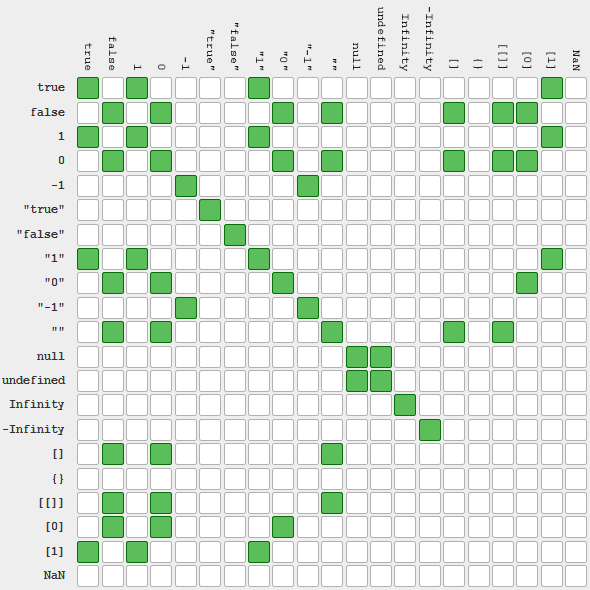

Логическое И && возвращает true тогда и только тогда, когда оба операнда преобразуются в true.
Логическое ИЛИ || возвращает true если хотя бы один или оба операнда преобразуются в true.
Операторы && и || поддерживают сокращенное вычисление: если первого операнда достаточно для определения результата, второй операнд не оценивается. Так, если первый операнд логического И && эквивалентен значению false, то второй операнд не оценивается. В случае с логическим ИЛИ || наоборот, правый операнд не оценивается, если левый эквивалентен значению true.
Логическое отрицание НЕ ! используется для инверсии (переворачивание смысла) логического значения своего операнда и всегда возвращает true или false.
С помощью двух логических НЕ !! можно преобразовать значение операнда в его логический эквивалент.
Логические операторы !, && и || имеют разные приоритеты – соответственно 16, 6 и 5. Поэтому встретившись в одном выражении (без приоритетных скобок) эти операторы выполнятся в указанной последовательности.
